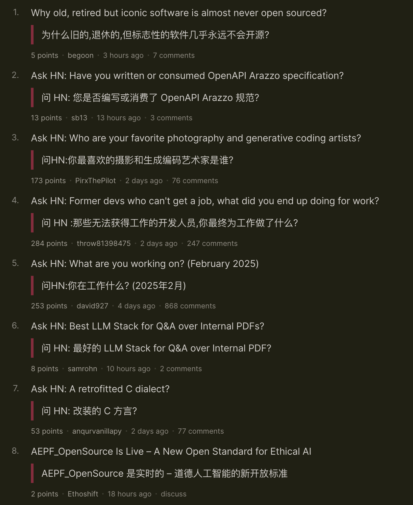

# MTranServer 
> ミニ翻訳サーバー

[English](README_en.md) | [中文](README.md) | 日本語

CPUと1GBのメモリのみで動作する超軽量・高速なオフライン翻訳サーバーです。GPUは不要で、1リクエストあたりの平均応答時間は50msです。

翻訳品質はGoogle翻訳に匹敵します。

注意：このモデルはパフォーマンスの最適化に重点を置いているため、大規模言語モデルと比べると翻訳品質は劣ります。

## 類似プロジェクトとの比較（CPU、英語から中国語）

| プロジェクト名 | メモリ使用量 | 同時処理性能 | 翻訳品質 | 速度 | 追加情報 |
|----------------|--------------|--------------|----------|--------|------------|
| [facebook/nllb-200-distilled-600M](https://github.com/thammegowda/nllb-serve) | 非常に高い | 低い | 普通 | 遅い | AndroidのRTranslatorは最適化されていますが、リソース使用量は依然として高く、速度も遅いです |
| [LibreTranslate](https://github.com/LibreTranslate/LibreTranslate) | 非常に高い | 普通 | 普通 | 中程度 | 中級CPUで3文/秒、高級CPUで15-20文/秒。[詳細](https://community.libretranslate.com/t/performance-benchmark-data/486) |
| [OPUS-MT](https://github.com/OpenNMT/CTranslate2#benchmarks) | 高い | 普通 | やや劣る | 速い | [性能テスト](https://github.com/OpenNMT/CTranslate2#benchmarks) |
| MTranServer（本プロジェクト） | 低い | 高い | 普通 | 超高速 | 1リクエストあたりの平均応答時間50ms |

※非厳密なテスト、非量子化バージョンの比較、参考値として。

## Docker Composeでのサーバーデプロイ

現在、amd64アーキテクチャCPUのDockerデプロイメントのみをサポートしています。

ARM、RISCVアーキテクチャは開発中です 😳

## クライアントバージョン

Windows、Macクライアントバージョン（[MTranServerCore](https://github.com/xxnuo/MTranServerCore)）は開発中です（まだ非公開）。現在はブラウザで没入型翻訳プラグインやKiss Translatorプラグインを使用できます。

## サポート

[☕️ Afdianで支援する](https://afdian.com/a/xxnuo)

---

WeChat: x-xnuo

X: [@realxxnuo](https://x.com/realxxnuo)

技術やオープンソースプロジェクトについて気軽にご連絡ください！

現在、求職中です。履歴書をご覧になりたい方はご連絡ください。

--- 