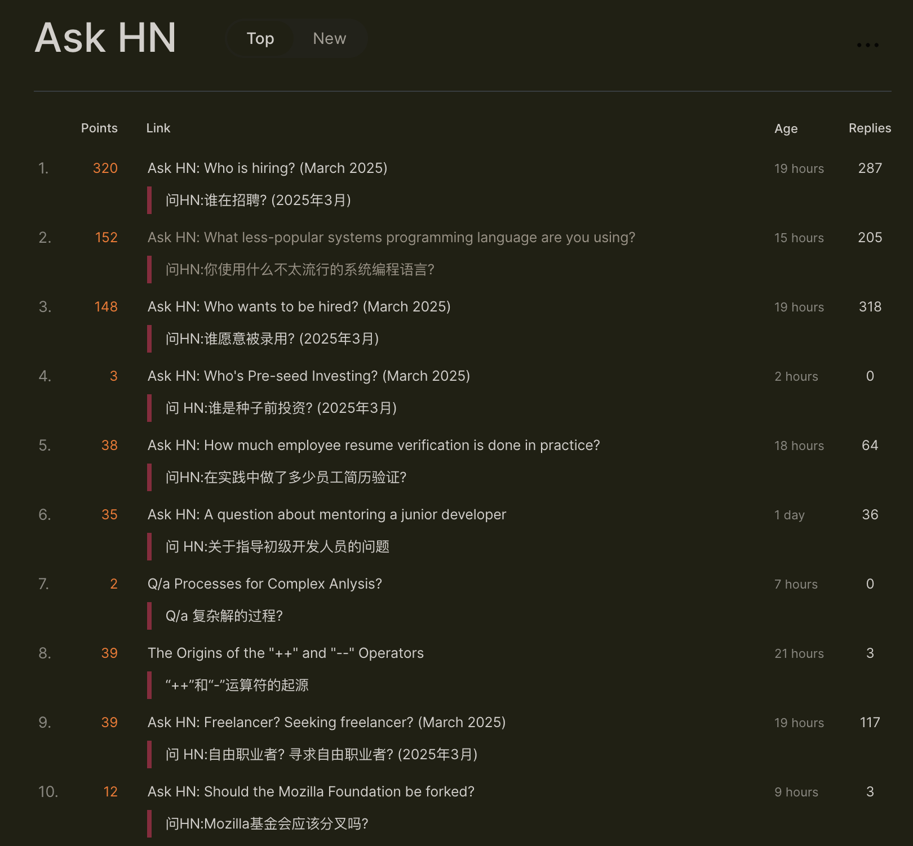
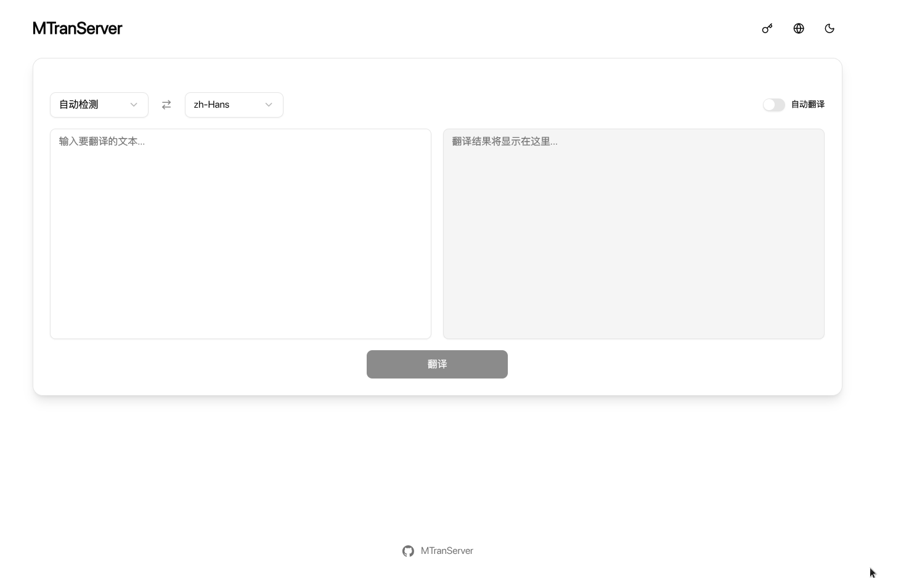

# MTranServer

[中文](../README.md) | [English](README_en.md) | [日本語](README_ja.md) | [Français](README_fr.md) | [Deutsch](README_de.md)

<!--  -->

Un serveur de modèle de traduction hors ligne ultra-rapide avec une consommation de ressources minimale. Aucune carte graphique requise. Temps de réponse moyen de 50 ms par requête. Prend en charge la traduction des principales langues du monde.

Notez que ce serveur de modèle se concentre sur la `traduction hors ligne`, la `vitesse de réponse`, le `déploiement multiplateforme` et l'`exécution locale` pour atteindre l'objectif de `traduction gratuite illimitée`. En raison des contraintes de taille et d'optimisation du modèle, la qualité de la traduction ne sera certainement pas aussi bonne que celle des grands modèles de traduction. Pour une traduction de haute qualité, il est recommandé d'utiliser les API de grands modèles en ligne.

> v4 a optimisé l'utilisation de la mémoire, amélioré encore la vitesse et renforcé la stabilité. Si vous utilisez une ancienne version, il est recommandé de mettre à niveau immédiatement !



## Démo en ligne

| Site Web                         | TOKEN                     | Autre interface                                                                                | Fournisseur |
| -------------------------------- | ------------------------- | ---------------------------------------------------------------------------------------------- | ----------- |
| `https://MTranServer.ipacel.cc/` | `__IpacEL_MT_API_TOKEN__` | Immersive Translate : `https://MTranServer.ipacel.cc/imme?token=__IpacEL_MT_API_TOKEN__` | @ApliNi     |

Merci aux contributeurs de la communauté pour fournir des services d'essai aux utilisateurs !

## Guide d'utilisation

Téléchargez la dernière version pour votre plateforme depuis les [Releases](https://github.com/xxnuo/MTranServer/releases), et lancez simplement le programme en ligne de commande pour l'utiliser.

[MTranServer](https://github.com/xxnuo/MTranServer) est principalement destiné à un environnement serveur, c'est pourquoi seuls le service en ligne de commande et le déploiement Docker sont actuellement disponibles.

Il est prévu de fournir une application de bureau et une extension de navigateur pour faciliter l'utilisation, restez à l'écoute.

> **Remarque importante :**
>
> Lors de la première traduction d'une paire de langues, le serveur téléchargera automatiquement le modèle de traduction correspondant (sauf si le mode hors ligne est activé). Ce processus peut prendre un certain temps en fonction de la vitesse de votre réseau et de la taille du modèle. Une fois le modèle téléchargé, les requêtes de traduction suivantes bénéficieront d'un temps de réponse de l'ordre de la milliseconde. Il est recommandé de tester une traduction avant l'utilisation réelle pour permettre au serveur de pré-télécharger et de charger le modèle.
>
> Le programme est souvent mis à jour. Si vous rencontrez des problèmes, essayez de mettre à jour vers la dernière version.

Après le démarrage du serveur, l'adresse de l'interface utilisateur simple incluse dans le programme et l'adresse de la documentation en ligne seront affichées dans les journaux. Voici un aperçu :




### Arguments de la ligne de commande

```bash
./mtranserver [options]

Options :
  -version, -v          Afficher les informations de version
  -log-level string     Niveau de journalisation (debug, info, warn, error) (par défaut "warn")
  -config-dir string    Répertoire de configuration (par défaut "~/.config/mtran/server")
  -model-dir string     Répertoire des modèles (par défaut "~/.config/mtran/models")
  -host string          Adresse d'écoute du serveur (par défaut "0.0.0.0")
  -port string          Port du serveur (par défaut "8989")
  -ui                   Activer l'interface Web (par défaut true)
  -offline              Activer le mode hors ligne, ne pas télécharger automatiquement les nouveaux modèles (par défaut false)
  -worker-idle-timeout int  Délai d'inactivité du Worker en secondes (par défaut 300)

Exemples :
  ./mtranserver --host 127.0.0.1 --port 8080
  ./mtranserver --ui --offline
  ./mtranserver -v
```

### Déploiement Docker Compose

Créez un répertoire vide, puis créez un fichier `compose.yml` avec le contenu suivant :

```yml
services:
  mtranserver:
    image: xxnuo/mtranserver:latest
    container_name: mtranserver
    restart: unless-stopped
    ports:
      - "8989:8989"
    environment:
      - MT_HOST=0.0.0.0
      - MT_PORT=8989
      - MT_ENABLE_UI=true
      - MT_OFFLINE=false
      # - MT_API_TOKEN=votre_jeton_secret_ici
    volumes:
      - ./models:/app/models
```

```bash
docker pull xxnuo/mtranserver:latest
docker compose up -d
```

#### Interface compatible avec les plugins de traduction

Le serveur fournit plusieurs interfaces compatibles avec les plugins de traduction :

| Interface | Méthode | Description | Plugins supportés |
| --------- | ------- | ----------- | ----------------- |
| `/imme` | POST | Interface pour le plugin Immersive Translate | [Immersive Translate](https://immersivetranslate.com/) |
| `/kiss` | POST | Interface pour le plugin Kiss Translator | [Kiss Translator](https://github.com/fishjar/kiss-translator) |
| `/deepl` | POST | Interface compatible DeepL API v2 | Clients supportant l'API DeepL |
| `/google/language/translate/v2` | POST | Interface compatible Google Translate API v2 | Clients supportant l'API Google Translate |
| `/google/translate_a/single` | GET | Interface compatible Google translate_a/single | Clients supportant la traduction web Google |
| `/hcfy` | POST | Interface compatible Selection Translator | [Selection Translator](https://github.com/Selection-Translator/crx-selection-translate) |

**Guide de configuration des plugins :**

> Note :
>
> - [Immersive Translate](https://immersivetranslate.com/docs/services/custom/) : Activez les fonctionnalités `Beta` dans le mode développeur de la page `Paramètres`, et vous verrez `Paramètres API personnalisés` dans `Services de traduction` ([tutoriel officiel avec images](https://immersivetranslate.com/docs/services/custom/)). Ensuite, augmentez le `Nombre maximum de requêtes par seconde` dans `Paramètres API personnalisés` pour utiliser pleinement les performances du serveur. J'ai réglé le `Nombre maximum de requêtes par seconde` à `512` et le `Nombre maximum de paragraphes par requête` à `1`. Vous pouvez ajuster cela en fonction de la configuration de votre serveur.
>
> - [Kiss Translator](https://github.com/fishjar/kiss-translator) : Faites défiler vers le bas dans la page `Paramètres` jusqu'aux paramètres d'interface, vous verrez l'interface personnalisée `Custom`. De même, réglez le `Nombre maximum de requêtes simultanées` et le `Temps d'intervalle entre chaque requête` pour utiliser pleinement les performances du serveur. J'ai réglé le `Nombre maximum de requêtes simultanées` à `100` et le `Temps d'intervalle entre chaque requête` à `1`. Vous pouvez ajuster cela en fonction de la configuration de votre serveur.
>
> Ensuite, configurez l'adresse de l'interface personnalisée du plugin selon le tableau ci-dessous.

| Nom | URL | Réglage du plugin |
| --- | --- | ----------------- |
| Immersive Translate sans mot de passe | `http://localhost:8989/imme` | `Paramètres API personnalisés` - `URL de l'API` |
| Immersive Translate avec mot de passe | `http://localhost:8989/imme?token=your_token` | Idem, changez `your_token` à la fin de l'URL par la valeur de votre `MT_API_TOKEN` |
| Kiss Translator sans mot de passe | `http://localhost:8989/kiss` | `Paramètres d'interface` - `Custom` - `URL` |
| Kiss Translator avec mot de passe | `http://localhost:8989/kiss` | Idem, remplissez `KEY` avec `your_token` |
| Compatible DeepL | `http://localhost:8989/deepl` | Utilisez l'authentification `DeepL-Auth-Key` ou `Bearer` |
| Compatible Google | `http://localhost:8989/google/language/translate/v2` | Utilisez le paramètre `key` ou l'authentification `Bearer` |
| Selection Translator | `http://localhost:8989/hcfy` | Supporte le paramètre `token` ou l'authentification `Bearer` |

**Les utilisateurs ordinaires peuvent utiliser le service en configurant l'adresse de l'interface du plugin selon le contenu du tableau.**

## Projets similaires

Voici quelques projets avec des fonctionnalités similaires. Si vous avez d'autres besoins, vous pouvez essayer ces projets :

| Nom du projet | Utilisation mémoire | Performance concurrente | Qualité traduction | Vitesse | Autres informations |
| ------------- | ------------------- | ----------------------- | ------------------ | ------- | ------------------- |
| [NLLB](https://github.com/facebookresearch/fairseq/tree/nllb) | Très élevée | Mauvaise | Moyenne | Lente | Le portage Android [RTranslator](https://github.com/niedev/RTranslator) a de nombreuses optimisations, mais l'utilisation des ressources reste élevée et ce n'est pas rapide |
| [LibreTranslate](https://github.com/LibreTranslate/LibreTranslate) | Très élevée | Moyenne | Moyenne | Moyenne | Un CPU milieu de gamme traite 3 phrases/s, un CPU haut de gamme 15-20 phrases/s. [Détails](https://community.libretranslate.com/t/performance-benchmark-data/486) |
| [OPUS-MT](https://github.com/OpenNMT/CTranslate2#benchmarks) | Élevée | Moyenne | Assez mauvaise | Rapide | [Tests de performance](https://github.com/OpenNMT/CTranslate2#benchmarks) |
| Autres grands modèles | Ultra élevée | Dynamique | Très bonne | Très lente | Exigences matérielles élevées. Si vous avez besoin d'une traduction à haute concurrence, il est recommandé d'utiliser le framework vllm pour contrôler la concurrence via l'utilisation de la mémoire et de la VRAM |
| Ce projet | Faible | Élevée | Moyenne | Ultra rapide | Temps de réponse moyen de 50 ms par requête. |

> Les données du tableau sont pour des tests simples CPU, scénarios anglais vers chinois, pas des tests stricts, comparaison de versions non quantifiées, pour référence seulement.

# Guide de configuration avancée

Veuillez vous référer au fichier [API_fr.md](API_fr.md) et à la documentation API après le démarrage.

## Star History

[](https://www.star-history.com/#xxnuo/MTranServer&Timeline)

## Thanks

[Bergamot Project](https://browser.mt/) for awesome idea of local translation.

[Mozilla](https://github.com/mozilla) for the [models](https://github.com/mozilla/firefox-translations-models).
